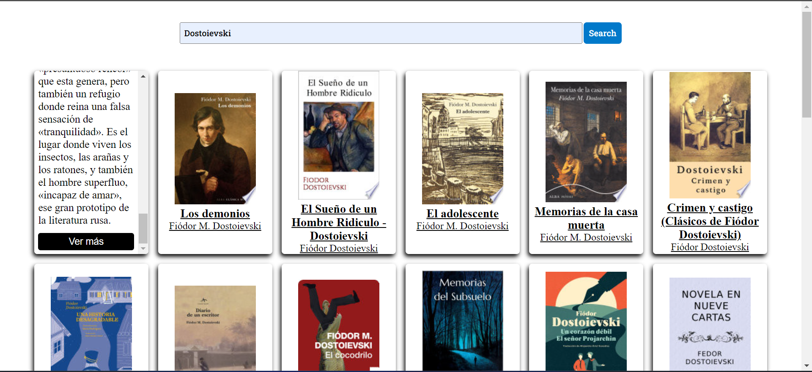
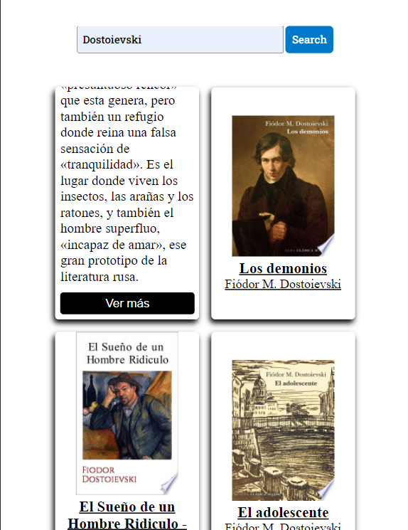

## Digital Books

- Resumen

  - Desktop
    
  - Mobile
    

  ### Los libros se ven en forma de cartas, al hacer click en una de ellas te muestra una descripción cortita y abajo un botón donde prodras ver mas información sobre el libro.

- ### Tecnologias que he utilizado aquí

  - JavaScript

  - TypeScript
  - Custom Elements
  - API REST (Google Books)
  - CSS
  - HTML
  - Git
  - Parcel
